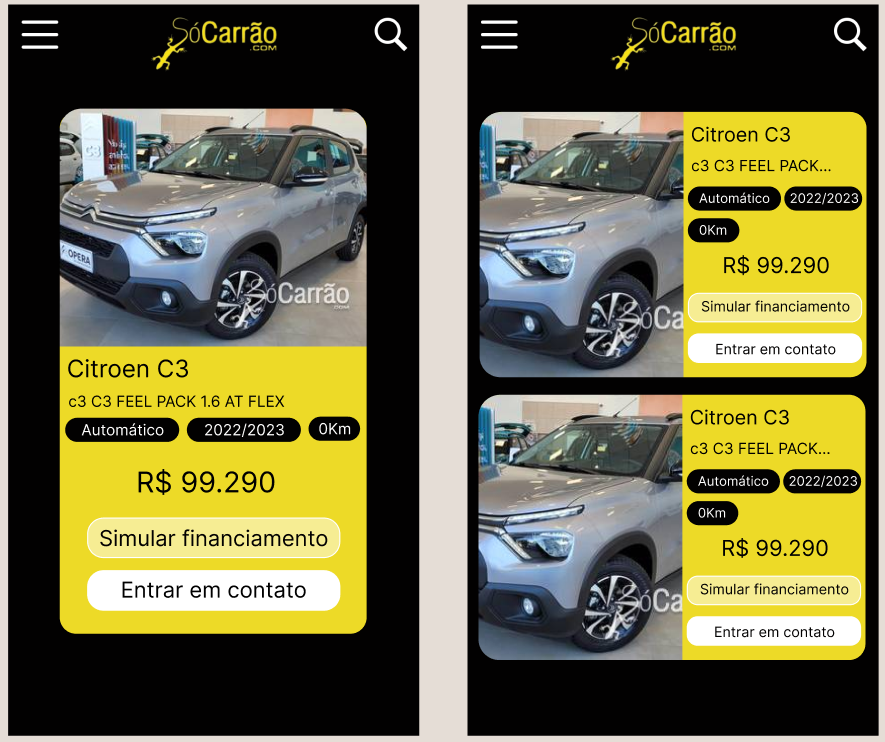
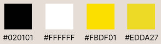

## Desafio SóCarrão 🚗

  

  

Desafio proposto pela empresa SóCarrão no Talent Fest 2023 da Laboratória 

 

  
  
  
  
  
  
   
  
  

 

## Sobre o desafio

O objetivo do desafio é consumir um JSON contendo dados de aproximadamente 50 veículos e lista-los em formato de cards. A listagem de veículos deverá respeitar o padrão de marca e modelo, além de ser responsiva e paginada. 

## Protótipos

### Cores escolhidas para o desafio

## Objetivos alcançados

✅ Listagem de Veículos: Os veículos disponíveis estão sendo apresentados em formato de cards, seguindo o padrão de exibição discursiva da marca e modelo. Quando o limite de espaço no card é alcançado, o nome da marca é escondido, deixando apenas o modelo. Quando o espaço no card é insuficiente para exibir o nome da Marca e do Modelo, é utilizado uma elipse para representar a informação omitida.

✅ Detalhes do Veículo: Cada card exibe as seguintes informações sobre o veículo:
* Foto;
* Marca;
* Modelo;
* Versão;
* Transmissão (automática ou manual);
* Ano;
* Preço;
* Quilometragem;
* Botão de "Simular Financiamento";
* Botão de "Entrar em contato".

✅ Escolha de Apresentação: O usuário tem a opção de escolher a forma de apresentação dos cards, podendo optar entre o layout horizontal ou vertical.

✅ Responsividade: Os cards se adaptam aos três principais breakpoints (320px, 375px e 420px), proporcionando uma experiência agradável em dispositivos móveis.

✅ Paginação: A listagem de veículos é paginada, permitindo que o usuário defina quantos cards deseja ver por página.